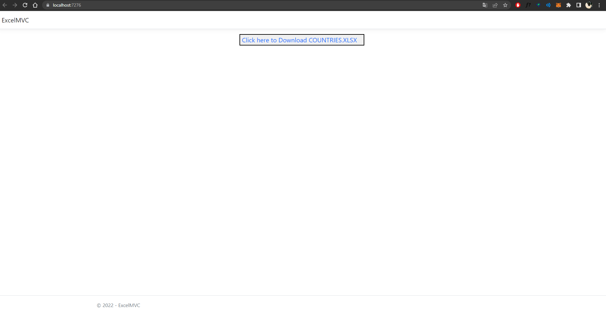
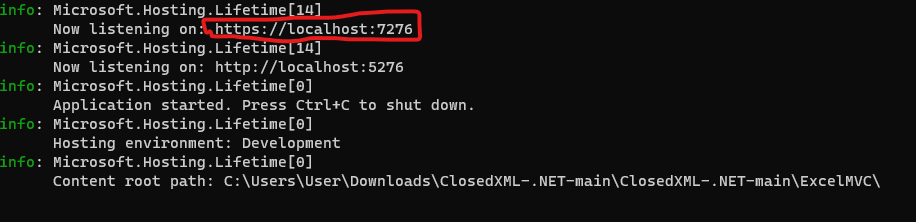
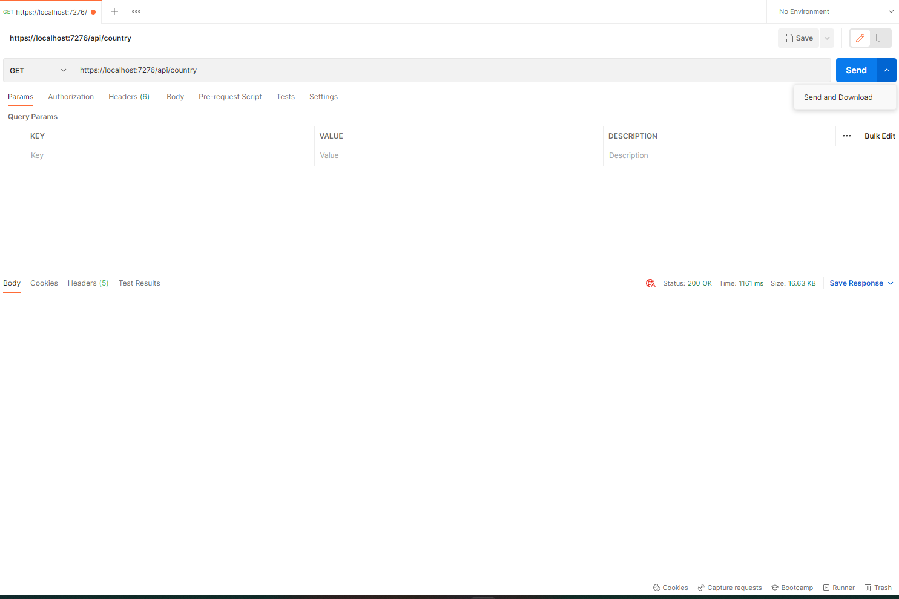

# ClosedXML-.NET
## Consuming RestCountries API with Asp .NET Core with Refit and ClosedXML

To execute project
open project root folder and run the following command on terminal

```
  dotnet run --project ExcelMVC/ExcelMVC.csproj
```
it will run project in your local machine 

to get excel, open your browser and paste the generated link on your terminal logs and click on the button to download, or go to **/api/country** Endpoint 



or open **Postman** and click in ***SEND AND DOWNLOAD*** d with the url pasted with the endpoint **/api/country** and method setted to ***GET***



